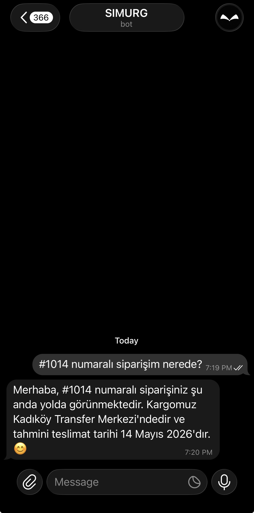
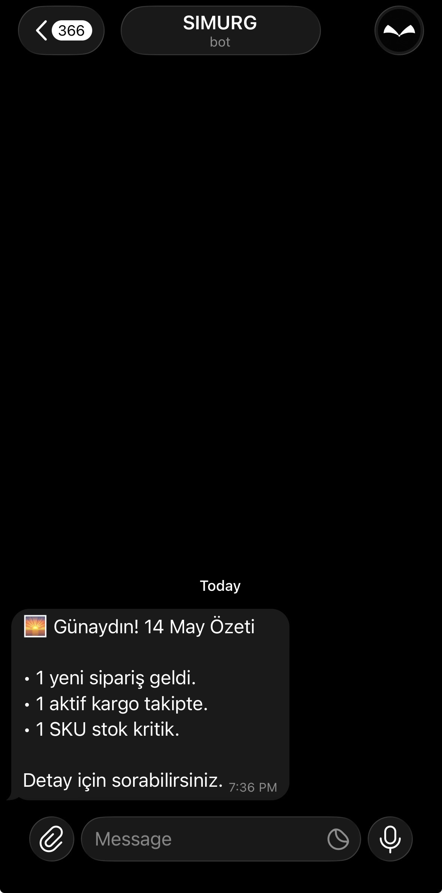
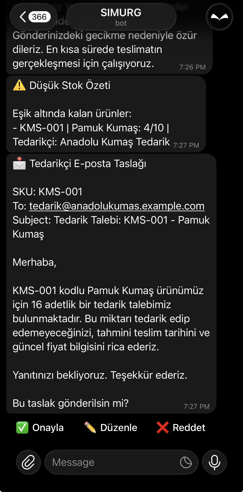
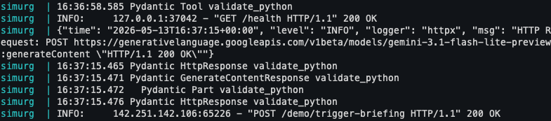

<div align="center">
  
  <h1>Simurg</h1>
  <p><strong>Proactive AI operations for e-commerce</strong></p>

  
  
  
  
  
  
</div>

---

Small business owners spend 2–3 hours a day answering the same questions: *Where is my order? Is this in stock?* Simurg handles it and acts on problems before anyone asks.

<p align="center">
  
  &nbsp;&nbsp;
  
</p>
<p align="center">
  
  &nbsp;&nbsp;
  
</p>

---

## What Simurg does

### Answers customer questions instantly
A customer texts the bot in plain Turkish. Simurg queries real order and shipment data, responds in under 5 seconds. No decision trees, no scripted replies — live tool calls against your database on every message.

### Notifies before customers complain
Simurg continuously scans for cargo anomalies: shipments stuck at a branch too long, deliveries past their ETA. When it finds one, it messages the affected customer proactively. The customer never had to ask.

### Briefs the owner every morning
At 08:00, the owner receives a structured daily summary via Telegram: orders from the previous day, active shipment count, delayed cargo alerts, and critical stock levels. One message. No dashboard to open.

### Handles stock replenishment — with your approval
When a SKU drops below its reorder threshold, Simurg drafts a supplier email in natural Turkish and sends it to the owner with **Approve / Edit / Reject** inline buttons. Nothing reaches the supplier without explicit confirmation.

---

## Why Simurg

**Built for Turkish compliance.**
The 2026 KVKK Active AI guidelines require personal data to be masked before it reaches an LLM. Simurg's PII redaction layer does exactly this — customer names, phone numbers, IBANs, and email addresses never reach Gemini. Every tool call is logged in its redacted form.

**Proactive, not reactive.**
Every competitor in the Turkish market waits for a customer to write first. Simurg doesn't. The proactive notification loop runs independently of any customer action — anomalies are caught and communicated before they become complaints.

**No markup on messaging costs.**
In Phase 1, Simurg connects to WhatsApp Cloud API directly — not through a Business Solution Provider. Your Meta conversation fees go directly to Meta. No intermediary cut, no overage surprises. Existing BSP-based tools take a 5–15% markup.

**Designed for Turkish e-commerce infrastructure.**
Phase 1 integrates ikas. Phase 2 adds Ticimax, IdeaSoft, and T-Soft. The `EcommerceProvider` abstraction in the codebase makes each new connector a single implementation, not a rewrite. Foreign tools ship with Shopify.

---

## Getting started

### Prerequisites

- Docker and Docker Compose
- A Telegram bot token — create one via [@BotFather](https://t.me/BotFather)
- A Gemini API key — [Google AI Studio](https://aistudio.google.com)
- A public HTTPS URL for the webhook (ngrok works for local development)

### Setup

```bash
git clone <repo-url>
cd <repo>

cp .env.example .env
# Edit .env — fill in the four required values:
#   GEMINI_API_KEY
#   TELEGRAM_BOT_TOKEN
#   TELEGRAM_WEBHOOK_SECRET   (generate: openssl rand -hex 32)
#   OWNER_TELEGRAM_ID         (your Telegram numeric user ID)

docker compose up
```

### Register the Telegram webhook

```bash
bash scripts/set_webhook.sh
```

Run this again whenever your ngrok URL changes — stale webhooks silently drop all messages.

### Load demo data

```bash
curl -X POST http://localhost:8000/demo/reset
```

The bot is live. Send it a message from your customer test account.

---

## Demo endpoints

| Endpoint | What it does |
|---|---|
| `POST /demo/reset` | Clear all tables and reload seed fixtures |
| `POST /demo/set-anomaly` | Push a specific shipment into anomaly state |
| `POST /demo/trigger-jobs` | Run the proactive agent (anomaly + low-stock scan) |
| `POST /demo/trigger-briefing` | Send the morning briefing to the owner now |
| `GET /health` | Liveness check |

> **Before any demo run:** The customer test account must have sent `/start` to the bot at least once. Without it, all proactive messages to that account will fail with `Forbidden: bot can't initiate conversation`.

---

## Roadmap

### Phase 1 — Production (Q3 2026)

The MVP runs on mock data and Telegram. Phase 1 connects to the real world.

- **Live ikas integration** — real order, shipment, and stock data via `EcommerceProvider` interface
- **WhatsApp Cloud API** — direct connection replaces Telegram for customer-facing messages; no BSP intermediary
- **Scheduled jobs** — APScheduler replaces demo endpoints for proactive scans (06:00 anomaly check, 08:00 briefing)
- **Multi-tenant** — each merchant gets their own bot token, owner ID, and isolated data scope

### Phase 2 — Integrations (Q4 2026)

- **Platform connectors** — Ticimax, IdeaSoft, T-Soft added as `EcommerceProvider` implementations
- **Domestic LLM option** — `LLMProvider` abstraction allows swapping Gemini for a KVKK-native model without touching agent prompts
- **RAG layer** — product FAQ and return policy documents embedded into pgvector; `CustomerSupportAgent` answers product questions from the knowledge base, not hallucination

### Phase 3 — Analytics & Scale (Q1 2027)

- **Operations dashboard** — deflection rate, autonomous resolution rate, average response latency per merchant
- **Cooperative model** — Simurg adapts to producer cooperatives: bulk orders, shared supplier negotiations, collective stock visibility across member businesses

---

## Stack

| Layer | Technology |
|---|---|
| API | FastAPI + Uvicorn |
| Agents | PydanticAI 1.93 |
| LLM | Gemini 2.5 Flash (via `LLMProvider` abstraction) |
| Database | PostgreSQL 16 + pgvector |
| Messaging | python-telegram-bot v21 (async) |
| Infrastructure | Docker Compose |

For agent design, tool catalog, and PII layer implementation details, see [`docs/ai-approach.md`](docs/ai-approach.md).

---

## License

Polyform-Noncommercial-1.0.0
