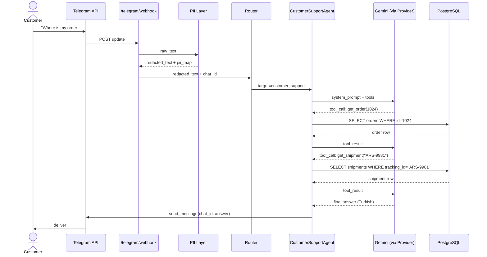
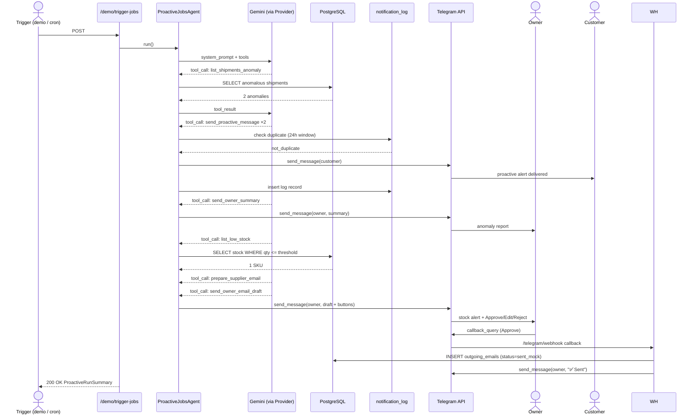
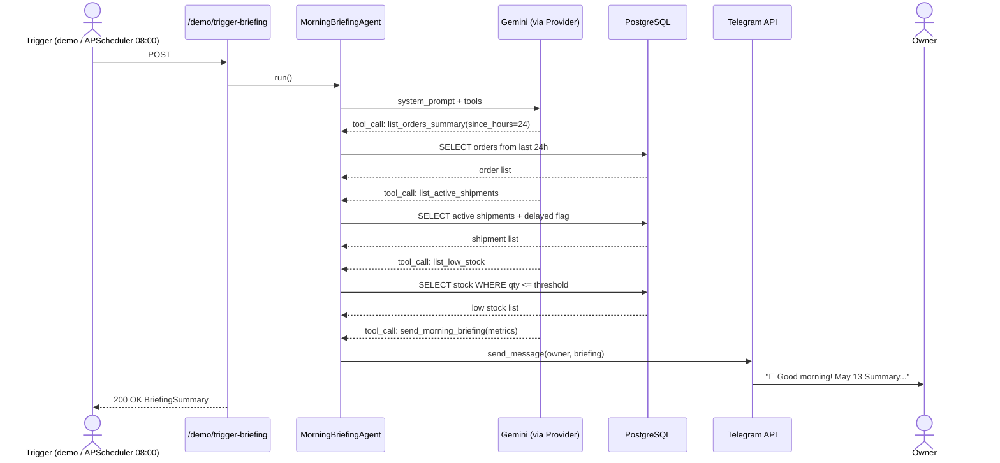

# Architecture

## Three hard rules

Every architectural decision in Simurg traces back to one of these three rules. If a change would violate any of them, it requires explicit justification.

| Rule | What it means | Why |
|---|---|---|
| **PII is a mandatory gateway** | Every free-text message from Telegram passes through `pii.redact()` before reaching any agent. The redacted version — never the original — is what the LLM sees. | The March 2026 KVKK Active AI guidelines explicitly require personal data to be masked before reaching an LLM. This is non-negotiable in the Turkish market. |
| **LLM is accessed through one point** | No agent imports `google.generativeai` directly. All model references go through `app.llm.provider.get_llm_model_string()`. | Phase 3 adds a domestic LLM option. Swapping providers must be a single-file change, not a codebase search. |
| **Messaging tools are idempotent** | `send_proactive_message`, `send_owner_summary`, and `send_email` check `notification_log` before sending. A second trigger within 24 hours for the same entity produces no duplicate message. | Proactive agents are triggered on a schedule. A customer must never receive the same alert twice. |

---

## Component diagram

```mermaid
flowchart TB
    subgraph External["External"]
        CustomerTG[Customer\nTelegram]
        OwnerTG[Owner\nTelegram]
        TelegramAPI[(Telegram Bot API)]
        GeminiAPI[(Gemini 2.5 Flash)]
    end

    subgraph App["FastAPI Application (Docker)"]
        WebhookEP[/telegram/webhook]
        DemoEP[/demo/* endpoints]

        PII[PII Redaction Layer]
        Router[Router — rule-based]

        subgraph Agents["Agents"]
            CSAgent[CustomerSupportAgent]
            PJAgent[ProactiveJobsAgent]
            MBAgent[MorningBriefingAgent]
        end

        Provider[LLMProvider]

        subgraph Tools["Tool Catalog"]
            DBTools[DB Tools\norders · shipments · stock]
            MsgTools[Messaging Tools\ntelegram wrappers]
            EmailTool[Email Tool\nmock]
        end
    end

    subgraph Data["Data Layer (Docker)"]
        Postgres[(PostgreSQL + pgvector)]
        Logs[stdout JSON logs]
    end

    CustomerTG -->|message| TelegramAPI
    OwnerTG -->|callback_query| TelegramAPI
    TelegramAPI -->|POST update| WebhookEP
    DemoEP -->|trigger| PJAgent
    DemoEP -->|trigger| MBAgent

    WebhookEP --> PII
    PII --> Router
    Router --> CSAgent
    Router --> PJAgent

    CSAgent --> Provider
    PJAgent --> Provider
    MBAgent --> Provider
    Provider --> GeminiAPI

    CSAgent --> DBTools
    CSAgent --> MsgTools
    PJAgent --> DBTools
    PJAgent --> MsgTools
    PJAgent --> EmailTool
    MBAgent --> DBTools
    MBAgent --> MsgTools

    DBTools --> Postgres
    MsgTools -->|send_message| TelegramAPI
    TelegramAPI -->|deliver| CustomerTG
    TelegramAPI -->|deliver| OwnerTG

    App -.->|all stages| Logs
```

---

## Sequence diagrams

### Flow A — Reactive customer query (S1)



---

### Flow B — Proactive scan (S2 + S3, triggered by `/demo/trigger-jobs` or cron)



---

### Flow C — Morning briefing (S4, triggered by `/demo/trigger-briefing` or 08:00 cron)



---

## Layer separation

```
app/
├── api/        → Receives HTTP, builds AgentDeps, calls agents
├── agents/     → Defines agents, imports tools — never imports DB directly
├── tools/      → Imports DB and security, registered with agents
└── security/   → PII redact/restore, imported by tools and api layer
```

The key invariant: `agents/` never imports from `db.py` or `models/tables.py`. All database access goes through `tools/`. This keeps agent logic testable without a real database and ensures the PII layer cannot be bypassed.

---

## Repo structure

```
.
├── app/
│   ├── main.py                  # FastAPI app + lifespan
│   ├── config.py                # Pydantic Settings
│   ├── db.py                    # Async engine + session factory
│   ├── agents/
│   │   ├── deps.py              # AgentDeps dataclass
│   │   ├── router.py            # Rule-based channel dispatch
│   │   ├── customer_support.py  # CustomerSupportAgent
│   │   └── proactive_jobs.py    # ProactiveJobsAgent + MorningBriefingAgent
│   ├── tools/
│   │   ├── orders.py            # get_order, list_orders_summary
│   │   ├── shipments.py         # get_shipment, list_shipments_anomaly, list_active_shipments
│   │   ├── stock.py             # list_low_stock
│   │   ├── email.py             # prepare_supplier_email (sub-agent), send_email mock
│   │   └── messaging.py         # send_proactive_message, send_owner_summary,
│   │                            # send_owner_email_draft, send_morning_briefing
│   ├── models/
│   │   ├── domain.py            # Pydantic tool I/O models (PII-free)
│   │   └── tables.py            # SQLAlchemy ORM tables
│   ├── llm/
│   │   └── provider.py          # get_llm_model_string() — single LLM access point
│   ├── security/
│   │   └── pii.py               # redact() + restore()
│   ├── api/
│   │   ├── webhook.py           # /telegram/webhook
│   │   ├── demo.py              # /demo/* control endpoints
│   │   └── health.py            # GET /health
│   └── seed/
│       └── fixtures.py          # Deterministic demo data
├── scripts/
│   ├── init_db.sql              # Schema DDL
│   └── set_webhook.sh           # Register Telegram webhook
├── tests/
│   └── smoke/
│       ├── test_pii.py          # PII redaction cases
│       ├── test_tools.py        # Tool contract tests
│       └── test_briefing.py     # Morning briefing agent tests
├── docker-compose.yml
├── Dockerfile
└── .env.example
```
